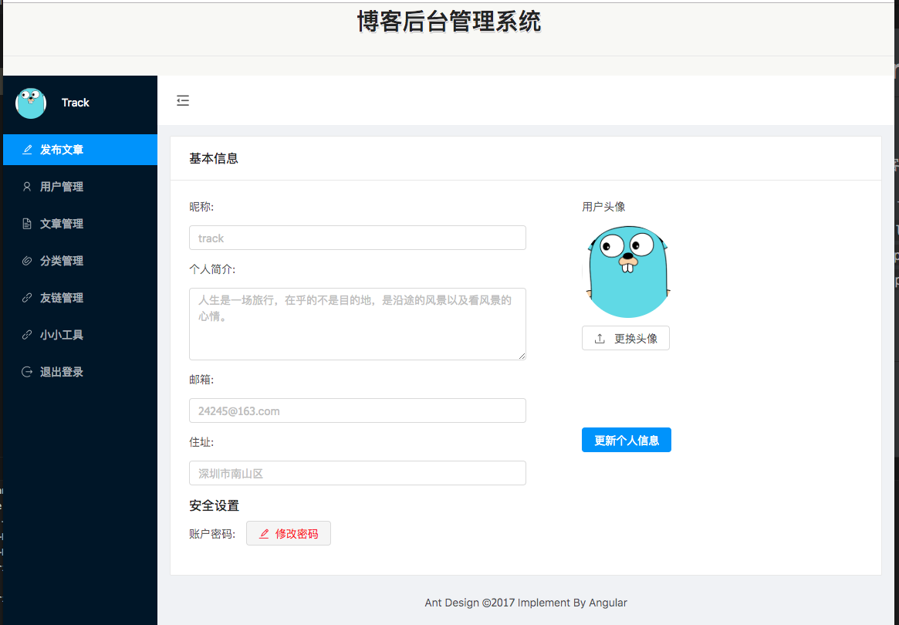

##Angular5-Blog-Admin

Angular5+Ant Design编写的简易版博客后台管理系统

+ 项目创建基于 [Angular CLI](https://github.com/angular/angular-cli) version 1.7.2.
+ 当前项目目录下, 使用 `npm install` 安装依赖
+ 测试环境使用`ng serve` 打开 `http://localhost:4200/`
+ 正式环境使用 `ng build --aot --prod` 编译打包位于`dist/`目录下

## 项目依赖
* [Ant Design](https://ng.ant.design/docs/introduce/zh)

## 其他项目
* [BlogFront博客客户端](https://github.com/lyw1995/Angular5-Blog-Front)
* [BlogServrer博客服务端](https://github.com/lyw1995/Golang-Blog-Server)
